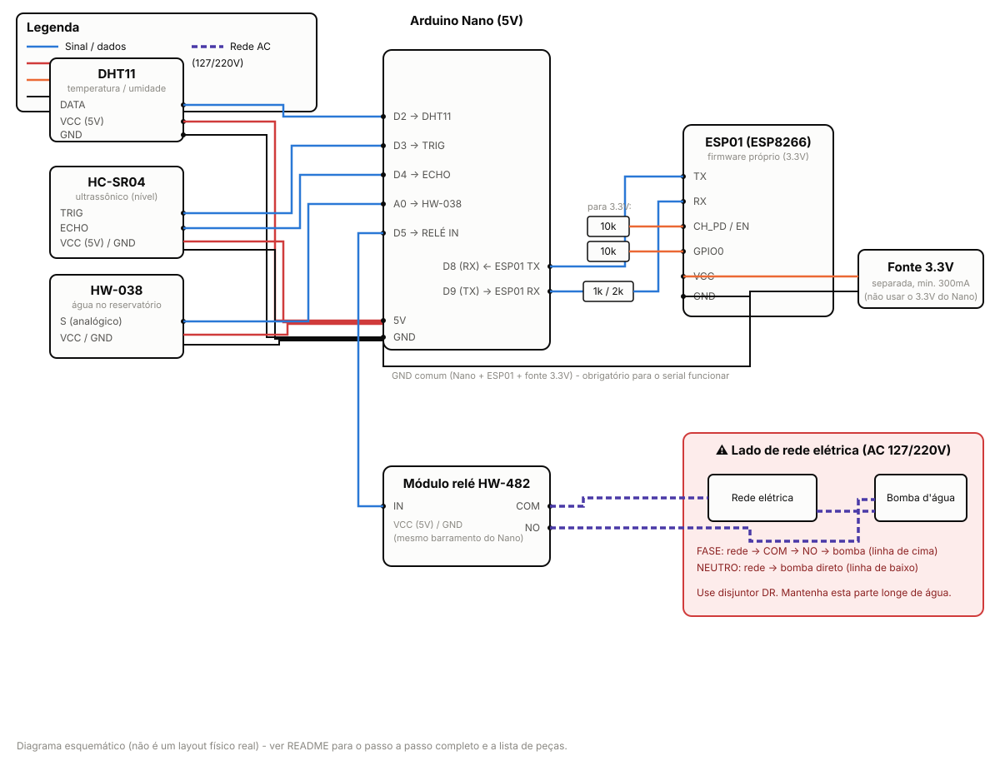

# Irrigador com Nível

> ✅ **Status deste projeto**: o Firebase (Realtime Database) e o dashboard no
> GitHub Pages já estão configurados e publicados:
> - Repositório: https://github.com/spylogic/irrigador-com-nivel
> - Dashboard ao vivo: https://spylogic.github.io/irrigador-com-nivel/
> - Projeto Firebase: `irrigador-com-nivel` (plano Spark, banco em `us-central1`)
> - URL do Realtime Database: `https://irrigador-com-nivel-default-rtdb.firebaseio.com`
> - Banco em **modo de teste** (regras abertas) - expira em **2026-10-12**;
>   veja "Segurança do Firebase" abaixo para tornar as regras permanentes
>   antes dessa data.
>
> O que falta para o sistema funcionar de ponta a ponta é só a parte física:
> montar o circuito, gravar os dois firmwares (seções 2 e 3 abaixo) e criar o
> `config.h` do ESP01 com a `FIREBASE_DATABASE_URL` acima.
>
> As medidas da caixa d'água (volume útil, distância do fundo e distância no
> nível máximo) **não precisam mais ser ajustadas no firmware** - agora dá
> pra configurar direto pelo dashboard, no card "Configuração da caixa
> d'água", o que permite reaproveitar o mesmo firmware em qualquer caixa.

Sistema de irrigação automática com:

- Monitoramento do nível da caixa d'água (sensor ultrassônico HC-SR04)
- Temperatura e umidade do ambiente (DHT11)
- Verificação de água no reservatório da bomba (HW-038), evitando que a bomba
  funcione a seco
- Acionamento da bomba de irrigação (módulo relé HW-482)
- Dashboard web com acesso de qualquer lugar do mundo, hospedado no GitHub
  Pages, com atualização em tempo real via Firebase
- Acionamento da bomba pelo botão do site **ou** por até **2 horários
  programados por dia**

## Peças

| Item | Peça | Alimentação |
|---|---|---|
| 1 | Arduino Nano | 5V |
| 2 | ESP01 (ESP8266) | 3.3V |
| 3 | Módulo sensor de umidade e temperatura DHT11 | 5V |
| 4 | Sensor de água HW-038 | 3-5V |
| 5 | Sensor ultrassônico HC-SR04 | 5V |
| 6 | Módulo relé HW-482 | 5V |

Além disso você vai precisar de:
- Uma fonte 3.3V separada para o ESP01 (mínimo ~300mA - **não** alimente o
  ESP01 pelo pino 3.3V do Nano, ele não aguenta a corrente)
- Resistores: dois de 10kΩ (CH_PD e GPIO0 do ESP01) e um par para o divisor
  de tensão 1kΩ + 2kΩ (TX do Nano → RX do ESP01)
- Um adaptador USB-Serial (ou o próprio Nano) para gravar o ESP01 separadamente
- Bomba de irrigação AC 127/220V + fiação e conector adequados para rede elétrica
- **Disjuntor DR (diferencial residual)** no circuito da bomba - fortemente
  recomendado por ser um sistema com água e eletricidade juntos

## Como o sistema funciona (visão geral)

```
[Sensores] --serial--> [Arduino Nano] <--serial--> [ESP01] <--WiFi/HTTPS--> [Firebase]
                             |                                                   |
                             v                                                   v
                         [Relé/Bomba]                                [Dashboard no GitHub Pages]
```

- O **Nano** lê os sensores e controla o relé. Ele tem as travas de
  segurança: só liga a bomba se houver água no reservatório, nunca deixa a
  bomba ligada continuamente por mais de 2 minutos, e desliga sozinho se
  perder a comunicação com o ESP01 por mais de 60 segundos.

  > ⚠️ **Atenção com essa trava de 2 minutos**: se um horário programado (ou
  > o botão "Ligar agora") pedir mais de 2 minutos seguidos de irrigação, a
  > bomba vai desligar sozinha nos 2 minutos e **não volta a ligar** durante
  > o resto daquela janela - ela só liga de novo quando o ESP01 mandar um
  > comando de "desligar" explícito, o que só acontece quando a janela
  > (horário ou override manual) termina. Ou seja, essa trava só deve ficar
  > menor que a duração real de irrigação se você quiser mesmo que ela corte
  > nesse tempo. Se quiser irrigar por mais de 2 minutos de uma vez, ajuste
  > `TEMPO_MAX_LIGADO_MS` no `nano_irrigacao.ino` para um valor acima da
  > maior duração que você configurar nos horários (ou no tempo que pretende
  > deixar ligado manualmente).
- O **ESP01** roda um firmware próprio (gravado por você, não o firmware de
  fábrica) que conecta no WiFi, pega a hora certa pela internet, publica os
  dados dos sensores no Firebase e decide, com base no horário programado ou
  no botão do site, se a bomba deve ligar - e manda esse comando pro Nano.
- O **dashboard** (GitHub Pages) lê e escreve direto no Firebase Realtime
  Database, então funciona de qualquer lugar do mundo, sem precisar abrir
  portas no seu roteador.

## Diagrama de ligação



Resumo dos pinos do Nano:

| Pino do Nano | Ligado a |
|---|---|
| D2 | DHT11 (DATA) |
| D3 | HC-SR04 (TRIG) |
| D4 | HC-SR04 (ECHO) |
| A0 | HW-038 (S / saída analógica) |
| D5 | HW-482 (IN) |
| D8 | ESP01 TX (direto) |
| D9 | ESP01 RX (através do divisor 1k/2k) |
| 5V / GND | Alimentação comum dos sensores e do relé |

**Importante:** o GND do Nano, do ESP01 e da fonte 3.3V do ESP01 precisam
estar todos ligados juntos (mesma referência), mesmo sendo fontes de tensão
diferentes (5V e 3.3V).

## ⚠️ Segurança elétrica (bomba AC 127/220V)

Este projeto aciona uma bomba ligada à rede elétrica, perto de água. Leve a
parte elétrica a sério:

- Só mexa na fiação AC com a energia **desligada** no disjuntor.
- O relé deve chavear apenas o fio **FASE**. O **NEUTRO** vai direto da rede
  para a bomba, sem passar pelo relé.
- Use um **disjuntor DR (diferencial residual)** dedicado a esse circuito.
- Deixe o módulo relé e toda a fiação AC dentro de uma caixa fechada,
  longe de qualquer respingo de água, e nunca no mesmo compartimento onde
  possa haver vazamento da caixa d'água ou do reservatório.
- Confira a corrente da sua bomba: o relé comum de 1 canal (tipo HW-482)
  costuma aguentar até 10A/250VAC, mas confira a etiqueta da sua bomba e do
  seu relé antes de ligar.
- Na dúvida, procure um eletricista para a parte de rede elétrica.

## 1. Configurar o Firebase (Realtime Database)

> ✅ **Já feito** para este projeto - pode pular para a seção 2. Os dados
> abaixo ficam só como referência (e caso precise recriar algo um dia).

1. Acesse [console.firebase.google.com](https://console.firebase.google.com)
   e crie um novo projeto (pode ser gratuito, plano Spark).
2. No menu lateral, vá em **Build > Realtime Database** e clique em
   **Criar banco de dados**. Escolha uma região próxima (ex.: `us-central1`).
3. Comece em **modo de teste** (regras abertas de leitura/escrita) - simples
   para começar, já que os dados aqui são só leituras de sensores e
   comandos, sem informação sensível. Depois que tudo estiver funcionando,
   você pode restringir as regras (ver seção "Segurança do Firebase" abaixo).
4. Anote a **URL do banco** (aparece no topo da página do Realtime Database,
   algo como `https://SEU-PROJETO-default-rtdb.firebaseio.com`). Neste
   projeto: `https://irrigador-com-nivel-default-rtdb.firebaseio.com`.
5. Em **Configurações do projeto (engrenagem) > Geral**, role até "Seus
   apps", clique em `</>` (Web) para registrar um app e copie o objeto
   `firebaseConfig` (apiKey, authDomain, databaseURL, etc.) - vai usar isso
   no dashboard. Neste projeto o `dashboard/firebase-config.js` já está
   preenchido com esses valores e publicado no GitHub Pages.

### Estrutura de dados usada

```jsonc
/status: {
  "level_pct": 78.4,        // nível da caixa em %, já calculado com o /config/tank atual
  "volume_l": 3.92,         // litros, calculado a partir de level_pct e tank.volume_l
  "distance_cm": 11.5,      // distância bruta lida pelo HC-SR04 (útil para calibrar)
  "temp_c": 24.5,
  "humidity_pct": 63.0,
  "water_present": true,    // tem água no reservatório da bomba?
  "pump_on": false,         // relé realmente ligado?
  "pump_commanded": false,  // ESP01 mandou ligar?
  "blocked_no_water": false,// bomba bloqueada por falta de água?
  "mode": "auto",           // "auto" | "on" | "off"
  "wifi_ok": true,
  "last_update": 1731000000 // epoch (segundos)
}

/config: {
  "manual": { "command": "auto", "requestedAt": 0 },
  "schedule": {
    "1": { "enabled": true,  "hour": 6,  "minute": 30, "duration_min": 5 },
    "2": { "enabled": false, "hour": 18, "minute": 0,  "duration_min": 5 }
  },
  "tank": {
    "volume_l": 5,          // volume útil da caixa, em litros
    "dist_fundo_cm": 30,    // distância do sensor até o fundo (caixa vazia)
    "dist_cheio_cm": 5      // distância do sensor até a água no nível máximo
  }
}
```

O card **"Configuração da caixa d'água"** no dashboard escreve direto em
`/config/tank` - é o que permite usar o mesmo firmware em qualquer caixa
d'água, sem precisar regravar Nano nem ESP01: o Nano só manda a distância
bruta (`distance_cm`) e o ESP01 é quem transforma isso em `level_pct` e
`volume_l`, usando as 3 medidas que estiverem salvas ali.

## 2. Gravar o firmware do ESP01

O ESP01 vai rodar um sketch próprio (não o firmware AT de fábrica).

1. Na IDE do Arduino, instale o suporte à placa: **Arquivo > Preferências >
   URLs Adicionais para Gerenciadores de Placas**, adicione:
   `http://arduino.esp8266.com/stable/package_esp8266com_index.json`
   Depois **Ferramentas > Placa > Gerenciador de Placas**, procure
   "esp8266" e instale o pacote da ESP8266 Community.
2. Instale a biblioteca **ArduinoJson** (de Benoit Blanchon) pelo Gerenciador
   de Bibliotecas.
3. Abra `firmware/esp01_irrigacao/esp01_irrigacao.ino`.
4. Copie `config_exemplo.h` para `config.h` (mesma pasta) e preencha:
   `WIFI_SSID`, `WIFI_SENHA` e `FIREBASE_DATABASE_URL` (a URL do passo 1).
5. Para gravar o ESP01 você precisa de um adaptador USB-Serial 3.3V (ou usar
   o Nano como programador, colocando-o em modo "passagem" - pesquise
   "Arduino as ISP para ESP01" caso não tenha o adaptador). Ligue:
   - Adaptador TX → ESP01 RX
   - Adaptador RX → ESP01 TX
   - GPIO0 → GND **apenas durante a gravação** (modo de gravação)
   - Depois de gravar, tire o GPIO0 do GND (ele deve ficar em nível alto via
     resistor de 10k para funcionar normalmente, como no diagrama)
6. Em **Ferramentas**, selecione a placa "Generic ESP8266 Module", e em
   **Flash Size** escolha "1M (FS:64KB OTA:~470KB)" (ou o maior que sua
   placa suportar - **ESP-01 de 512KB pode não ter espaço para o HTTPS**,
   prefira um ESP-01S de 1MB).
7. Grave o sketch. Depois de gravado, desligue o modo gravação (GPIO0 para
   3.3V via resistor 10k) e ligue o ESP01 na montagem final.

## 3. Gravar o firmware do Nano

1. Instale as bibliotecas **DHT sensor library** e **Adafruit Unified
   Sensor** (ambas de Adafruit) pelo Gerenciador de Bibliotecas.
2. Abra `firmware/nano_irrigacao/nano_irrigacao.ino`.
3. Se necessário, ajuste as constantes no topo do arquivo:
   - `SENSOR_ATE_NIVEL_MAX_CM`, `ALTURA_UTIL_CM`, `VOLUME_TOTAL_LITROS`: usadas
     só para o nível mostrado no Monitor Serial (debug local). O nível que
     aparece no **dashboard** usa as medidas do card "Configuração da caixa
     d'água" do site, não estas constantes - então normalmente não precisa
     mexer aqui, mesmo trocando de caixa d'água depois.
   - `LIMIAR_AGUA` (limiar do HW-038 - teste o sensor seco e molhado com o
     Monitor Serial aberto e ajuste esse número)
4. Selecione a placa "Arduino Nano" (e o processador correto - ATmega328P
   "Old Bootloader" em placas clone, se não conseguir gravar) e grave.
5. **Teste o sentido do relé antes de ligar a bomba de verdade:** com a
   bomba desconectada da rede, abra o Monitor Serial e veja se o relé liga
   quando deveria. Se estiver invertido (ligando quando devia desligar),
   troque `RELE_NIVEL_ATIVO` de `HIGH` para `LOW` no início do arquivo.

## 4. Publicar o dashboard no GitHub Pages

> ✅ **Já feito** para este projeto:
> - Repositório: https://github.com/spylogic/irrigador-com-nivel
> - Dashboard ao vivo: https://spylogic.github.io/irrigador-com-nivel/
>
> Os passos abaixo descrevem como foi feito (e servem de referência para
> atualizar o site no futuro ou recriar em outro repositório).

1. Edite `dashboard/firebase-config.js` com os dados do seu app Firebase
   (passo 1.5 acima).
2. Crie um repositório novo no GitHub (pode ser público - lembre-se que o
   `firebase-config.js` não contém segredos, só chaves públicas do Firebase).
3. Suba a pasta `dashboard/` (ou o projeto inteiro, sem problema) para o
   repositório:
   ```bash
   cd irrigador-nivel
   git init
   git add .
   git commit -m "Irrigador com nivel - versao inicial"
   git branch -M main
   git remote add origin https://github.com/SEU_USUARIO/SEU_REPOSITORIO.git
   git push -u origin main
   ```
4. O GitHub Pages padrão ("Deploy from a branch") só publica a raiz do
   repositório ou a pasta `/docs` - não uma pasta arbitrária como
   `/dashboard`. Por isso este projeto usa um workflow do **GitHub Actions**
   (`.github/workflows/pages.yml`, já incluído) que publica especificamente
   a pasta `dashboard/`. Para ativar: em **Settings > Pages**, em "Source"
   escolha **GitHub Actions** (em vez de "Deploy from a branch"). O workflow
   roda automaticamente a cada push na branch `main`, ou manualmente em
   **Actions > Publicar dashboard no GitHub Pages > Run workflow**.
5. Em alguns minutos (geralmente menos de 1 minuto) o site fica disponível em
   `https://SEU_USUARIO.github.io/SEU_REPOSITORIO/`.
6. Para atualizar o site depois de qualquer mudança nos arquivos de
   `dashboard/`, basta commitar/subir a mudança para `main` - o Actions
   republica sozinho.

## Segurança do Firebase (depois que tudo estiver funcionando)

O modo de teste deixa o banco aberto para qualquer pessoa que descobrir a
URL. Para um projeto pessoal isso costuma ser aceitável (não há dados
sensíveis), mas se quiser reforçar depois:

- Nas regras do Realtime Database, você pode exigir um token fixo
  (`FIREBASE_AUTH_TOKEN` no `config.h` do ESP01, e o mesmo valor no
  dashboard) comparando com `auth.token` numa regra customizada, ou migrar
  para Firebase Authentication (mais trabalho, mas mais robusto).
- Pelo menos limite as regras para impedir escrita de campos fora do
  esperado (`.validate`), evitando que alguém escreva lixo no seu banco.

## Solução de problemas

- **ESP01 não conecta no WiFi**: confira SSID/senha em `config.h`; o ESP01
  só conecta em redes 2.4GHz (não funciona em WiFi 5GHz).
- **Nano e ESP01 não se comunicam**: confira o GND comum, o divisor de
  tensão na linha Nano→ESP01, e se ambos estão em 9600 baud.
- **Nível sempre 0% ou 100%**: confira a distância real do sensor até a
  água e ajuste `SENSOR_ATE_NIVEL_MAX_CM` / `ALTURA_UTIL_CM`; o HC-SR04 tem
  alcance mínimo de ~2cm, então se o sensor ficar muito perto da água pode
  dar leitura errática.
- **Bomba não liga pelo site**: veja no dashboard se `blocked_no_water`
  está ativo (sem água no reservatório) e se o `mode` está em "auto" com
  nenhum horário cobrindo o horário atual - tente o botão "Ligar agora".
- **Dashboard não atualiza**: confira se `firebase-config.js` está com os
  dados corretos e se as regras do Realtime Database permitem leitura.

## Estrutura de arquivos

```
irrigador-nivel/
├── firmware/
│   ├── nano_irrigacao/nano_irrigacao.ino
│   └── esp01_irrigacao/
│       ├── esp01_irrigacao.ino
│       └── config_exemplo.h   (copie para config.h e preencha)
├── dashboard/
│   ├── index.html
│   ├── style.css
│   ├── app.js
│   └── firebase-config.js
├── docs/
│   └── wiring_diagram.svg
└── README.md
```

## Possíveis melhorias futuras

- Notificação (e-mail/WhatsApp) quando o nível da caixa ficar muito baixo
- Histórico/gráfico de nível, temperatura e umidade ao longo do tempo
- Mais de 2 horários por dia, ou horários diferentes por dia da semana
- Sensor de chuva para pular a irrigação programada em dias de chuva
